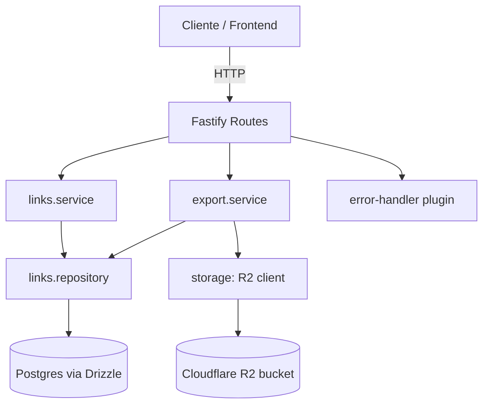

# Backend API (Brev.ly) Design

**Spec**: `.specs/features/backend-api/spec.md`
**Status**: Draft

---

## Architecture Overview

**Abordagens consideradas:**

| Abordagem | Descrição | Trade-off |
| --- | --- | --- |
| A — Rotas gordas | Handler Fastify chama Drizzle direto, sem camada de serviço | Rápido de escrever, mas mistura validação/regra de negócio com HTTP; difícil testar regra isolada |
| **B — Em camadas (recomendada)** | Rotas finas → Service (regra de negócio) → Repository (Drizzle) → DB; Storage/CSV isolados em módulo próprio | Um pouco mais de arquivos, mas cada peça é testável e substituível isoladamente |
| C — Hexagonal/Clean completo | Entidades de domínio, use-cases, ports/adapters | Ceremonial demais pra ~5 endpoints de um desafio solo — over-engineering |

**Recomendação**: **B**. É o meio-termo certo pro tamanho desse projeto: rotas finas, regra de negócio isolada em `service` (testável sem precisar subir o Fastify), acesso a dado isolado em `repository` (troca de driver/ORM não vaza pro resto), e a parte de CDN/CSV isolada porque é a única integração externa e a única com falha "de rede" real.



---

## Code Reuse Analysis

Projeto greenfield (repo só tem `.gitignore`, `LICENSE` e o export do Figma) — não há código backend existente pra reaproveitar. Nenhuma integração prévia.

### Integration Points

| System | Integration Method |
| --- | --- |
| Postgres | Drizzle ORM (`drizzle-orm` + `drizzle-kit`), migrations geradas em `server/drizzle/`, aplicadas via script `db:migrate` |
| Cloudflare R2 | AWS SDK v3 S3-compatible client (`@aws-sdk/client-s3`), `endpoint` apontando pro R2 (`https://<CLOUDFLARE_ACCOUNT_ID>.r2.cloudflarestorage.com`), `region: "auto"` |
| Frontend (feature futura) | Contrato HTTP definido abaixo (ver AD-008 em `STATE.md`) |

---

## Components

### `env` (config)
- **Purpose**: Carregar e validar as variáveis de ambiente uma única vez na subida do processo.
- **Location**: `server/src/env.ts`
- **Interfaces**: `env: { PORT, DATABASE_URL, CLOUDFLARE_ACCOUNT_ID, CLOUDFLARE_ACCESS_KEY_ID, CLOUDFLARE_SECRET_ACCESS_KEY, CLOUDFLARE_BUCKET, CLOUDFLARE_PUBLIC_URL }`
- **Dependencies**: `zod` (validação), `process.env`
- **Reuses**: n/a (primeiro módulo do projeto)

### `db` (schema + client)
- **Purpose**: Definir a tabela `links` e expor o client Drizzle conectado ao Postgres.
- **Location**: `server/src/db/schema.ts`, `server/src/db/client.ts`
- **Interfaces**: `db: NodePgDatabase`, `links: PgTable`
- **Dependencies**: `drizzle-orm`, `pg` (ou `postgres`), `env.DATABASE_URL`
- **Reuses**: n/a

### `links.repository`
- **Purpose**: Única camada que fala SQL/Drizzle para a tabela `links`.
- **Location**: `server/src/modules/links/links.repository.ts`
- **Interfaces**:
  - `create(data: { originalUrl: string; shortUrl: string }): Promise<Link>` — insere, propaga erro de unique violation (23505) pro service tratar
  - `findAllPaginated(page: number, limit: number): Promise<{ items: Link[]; total: number }>`
  - `deleteById(id: string): Promise<Link | undefined>`
  - `resolveAndIncrementAccess(shortUrl: string): Promise<Link | undefined>` — `UPDATE ... SET access_count = access_count + 1 ... RETURNING *`
  - `findAll(): Promise<Link[]>` — sem paginação, só para o export CSV
- **Dependencies**: `db` client
- **Reuses**: n/a

### `links.service`
- **Purpose**: Regra de negócio — validação de formato de slug/URL, tradução de erro de banco pra erro de domínio, orquestração das chamadas ao repository.
- **Location**: `server/src/modules/links/links.service.ts`
- **Interfaces**:
  - `createLink(input): Promise<Link>` — valida `shortUrl` (regex) e `originalUrl` (URL válida, ≤2048 chars) antes de chamar o repository; mapeia unique-violation → `ConflictError`
  - `listLinks(page, limit): Promise<{ items: Link[]; page; limit; total }>`
  - `deleteLink(id): Promise<void>` — lança `NotFoundError` se não achar
  - `resolveLink(shortUrl): Promise<Link>` — lança `NotFoundError` se não achar
- **Dependencies**: `links.repository`, `links.errors`
- **Reuses**: n/a

### `links.errors`
- **Purpose**: Erros de domínio tipados (`ValidationError`, `ConflictError`, `NotFoundError`), cada um com o status HTTP que representa.
- **Location**: `server/src/modules/links/links.errors.ts`
- **Interfaces**: `class ValidationError extends Error { statusCode = 400 }` (idem para os outros com 409/404)
- **Dependencies**: nenhuma
- **Reuses**: nenhuma

### `links.routes`
- **Purpose**: Registrar as rotas HTTP de `links`, validar payload/query com Zod, chamar o service, montar a resposta.
- **Location**: `server/src/modules/links/links.routes.ts`
- **Interfaces**: `POST /links`, `GET /links`, `DELETE /links/:id`, `GET /links/:shortUrl`
- **Dependencies**: `links.service`, Fastify instance
- **Reuses**: `error-handler` plugin (não faz try/catch manual — deixa o erro subir e o plugin traduz)

### `storage` (R2 client)
- **Purpose**: Encapsular o SDK S3 apontado pro Cloudflare R2 — único ponto que sabe sobre credenciais/endpoint de CDN.
- **Location**: `server/src/storage/r2-client.ts`
- **Interfaces**: `uploadCsv(content: string): Promise<{ key: string; url: string }>` — gera key aleatória (`crypto.randomUUID() + '.csv'`), faz `PutObjectCommand`, retorna a URL pública (`env.CLOUDFLARE_PUBLIC_URL` + key)
- **Dependencies**: `@aws-sdk/client-s3`, `env`
- **Reuses**: n/a

### `export.service`
- **Purpose**: Orquestrar a exportação — busca todos os links, monta o CSV, sobe pro R2.
- **Location**: `server/src/modules/export/export.service.ts`
- **Interfaces**: `exportLinksToCsv(): Promise<{ url: string }>`
- **Dependencies**: `links.repository` (via `findAll`), `storage.uploadCsv`, `csv.ts` (builder)
- **Reuses**: `links.repository`

### `csv` (builder)
- **Purpose**: Transformar `Link[]` em uma string CSV com cabeçalho fixo, escapando corretamente valores com vírgula/aspas/quebra de linha (RFC 4180).
- **Location**: `server/src/modules/export/csv.ts`
- **Interfaces**: `buildLinksCsv(links: Link[]): string` — cabeçalho literal `URL original,URL encurtada,Contagem de acessos,Data de criação` (nomes exatamente como o enunciado descreve os campos)
- **Dependencies**: nenhuma (função pura)
- **Reuses**: n/a

### `export.routes`
- **Purpose**: Expor a exportação como endpoint HTTP.
- **Location**: `server/src/modules/export/export.routes.ts`
- **Interfaces**: `GET /links/export`
- **Dependencies**: `export.service`
- **Reuses**: `error-handler` plugin

### `error-handler` (plugin Fastify)
- **Purpose**: Único lugar que traduz erro de domínio → `{statusCode, message}` JSON; erro desconhecido → 500 genérico (loga o erro real via `fastify.log`, não vaza detalhe pro cliente).
- **Location**: `server/src/plugins/error-handler.ts`
- **Dependencies**: `links.errors`
- **Reuses**: n/a

### `cors` (plugin Fastify)
- **Purpose**: Habilitar CORS pra qualquer origem (`@fastify/cors`, `origin: true`) — decisão AD-006.
- **Location**: `server/src/plugins/cors.ts`
- **Dependencies**: `@fastify/cors`
- **Reuses**: n/a

---

## Data Models

### `links` (tabela Postgres via Drizzle)

```typescript
export const links = pgTable('links', {
  id: uuid('id').primaryKey().$defaultFn(() => randomUUID()),
  originalUrl: text('original_url').notNull(),
  shortUrl: varchar('short_url', { length: 60 }).notNull().unique(),
  accessCount: integer('access_count').notNull().default(0),
  createdAt: timestamp('created_at', { withTimezone: true }).notNull().defaultNow(),
}, (table) => ({
  createdAtIdx: index('links_created_at_idx').on(table.createdAt),
}))
```

- `id` é gerado em JS (`crypto.randomUUID()`) via `$defaultFn` — evita depender da extensão `pgcrypto`/`uuid-ossp` no Postgres, então a migration não precisa habilitar extensão nenhuma.
- `shortUrl` tem constraint `unique()` — é essa constraint (não uma checagem prévia em memória) que garante `URL-04` mesmo sob concorrência.
- `createdAtIdx` sustenta `ORDER BY created_at DESC` performático na listagem (URL-05).

**Relationships**: tabela única, sem relacionamento — o domínio inteiro do desafio (backend) cabe numa entidade.

---

## Error Handling Strategy

| Error Scenario | Handling | User Impact |
| --- | --- | --- |
| Slug ou URL original mal formatada | `links.service` lança `ValidationError` (400) antes de tocar o banco | `{ message: "..." }` com 400 |
| Slug já existe (inclusive corrida concorrente) | Postgres rejeita o INSERT com unique-violation (`23505`); `links.repository`/`service` traduz pra `ConflictError` (409) | `{ message: "..." }` com 409 |
| Delete/resolve de algo que não existe | Repository retorna `undefined`; service lança `NotFoundError` (404) | `{ message: "..." }` com 404 |
| Falha de upload no R2 (rede/credencial) | `storage.uploadCsv` propaga o erro; `export.routes` não captura — sobe pro `error-handler`, que responde 500 sem inventar uma URL | `{ message: "..." }` com 500, nenhuma URL de CDN retornada |
| Erro não mapeado / bug interno | `error-handler` cai no branch genérico: loga stack via `fastify.log.error`, responde 500 com mensagem genérica | `{ message: "Internal server error" }`, sem vazar stack trace |

---

## Risks & Concerns

| Concern | Location | Impact | Mitigation |
| --- | --- | --- | --- |
| CSV ingênuo quebra se `original_url` contiver vírgula/aspas | `modules/export/csv.ts` | Relatório corrompido, colunas deslocadas | `buildLinksCsv` aplica quoting RFC 4180 (envolve em aspas e escapa aspas internas quando o campo contém `,`, `"` ou quebra de linha) |
| Export CSV carrega todos os links em memória de uma vez | `modules/export/export.service.ts` | Aceitável pro volume de um desafio; não escalaria pra milhões de linhas | Sem mitigação além de aceitar o limite — streaming seria over-engineering fora do escopo do desafio |
| `crypto.randomUUID()` exige Node ≥ 14.17 (estável a partir do 16) | `db/schema.ts`, `storage/r2-client.ts` | Quebraria em runtime muito antigo | Dockerfile fixa base `node:20-alpine` (ou LTS atual), então nunca é um risco real no ambiente que a imagem roda |
| Corrida em criação com o mesmo slug | `links.repository.create` | Duas criações concorrentes poderiam ambas "achar" o slug livre num check-then-insert | Design usa sempre INSERT direto + catch de `23505`, nunca check-then-insert (já registrado em AD-002 / spec) |

> Nenhum outro risco relevante encontrado — projeto greenfield, sem dívida técnica herdada.

---

## Tech Decisions (feature-local)

| Decision | Choice | Rationale |
| --- | --- | --- |
| Biblioteca de validação de schema | `zod` | Já é citado como "flexível" no enunciado (lado front) e integra bem com Fastify via `fastify-type-provider-zod`; evita escrever validação manual |
| Driver Postgres do Drizzle | `drizzle-orm/node-postgres` (`pg`) | Driver mais maduro/padrão do ecossistema Node pra Postgres; sem necessidade de recursos serverless-only |
| Rota de export é `GET /links/export`, não `POST` | `GET` | Semânticamente é "buscar um relatório" do ponto de vista do cliente, mesmo gerando um novo arquivo no bucket a cada chamada; simplifica o front (pode até usar como link direto de download) |
| Biblioteca de CSV | Função própria pequena (`buildLinksCsv`) em vez de dependência externa | Só 4 colunas, regra de escaping é simples de implementar corretamente; evita dependência extra pra algo trivial |
| SDK do bucket | `@aws-sdk/client-s3` (S3 compatível) | Cloudflare R2 expõe API S3-compatível; é o SDK oficialmente recomendado pela própria Cloudflare pra isso |

> **Decisões project-level (já promovidas pra `STATE.md`):** identificador por `id`, slug fornecido pelo usuário + regex, validação de URL original, resolve+increment atômico e combinado, paginação da listagem, CORS aberto, formato de erro `{message}` — ver AD-001 a AD-007. Este design acrescenta **AD-008** (contrato de rotas HTTP) abaixo.

---

## Tips followed
- Interfaces definidas antes da implementação (seção Components acima)
- Reuso: n/a (greenfield) — documentado explicitamente em vez de omitido
- Diagrama mermaid cobre o fluxo ponta a ponta
