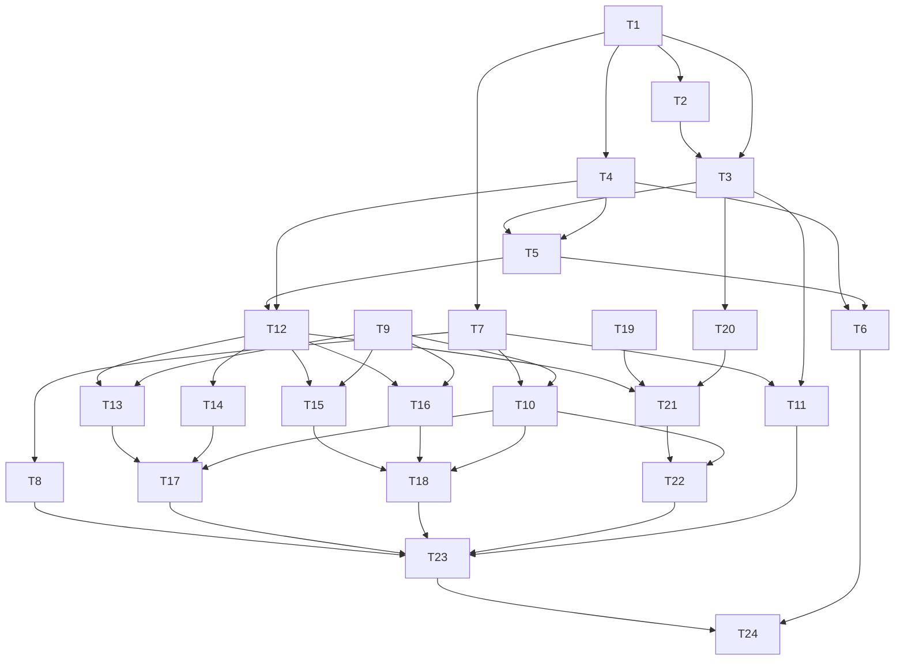

# Backend API (Brev.ly) Tasks

## Execution Protocol (MANDATORY -- do not skip)

Implement these tasks with the `tlc-spec-driven` skill: **activate it by name and follow its Execute flow and Critical Rules.** Do not search for skill files by filesystem path. The skill is the source of truth for the full flow (per-task cycle, sub-agent delegation, adequacy review, Verifier, discrimination sensor).

**If the skill cannot be activated, STOP and tell the user — do not proceed without it.**

---

**Design**: `.specs/features/backend-api/design.md`
**Status**: Draft

---

## Test Coverage Matrix

> Gerado a partir do design + decisões do usuário (repo greenfield, sem guideline de teste existente). Decisões confirmadas com o usuário: **Vitest, apenas testes unitários (sem Postgres real em teste)**; **client S3 mockado** para o upload no R2.

| Code Layer | Required Test Type | Coverage Expectation | Location Pattern | Run Command |
| --- | --- | --- | --- | --- |
| `links.service` (regra de negócio) | unit | Todas as branches; 1:1 com URL-01..08 e DEL-01..03; repository mockado | `server/src/modules/links/__tests__/links.service.test.ts` | `npm test` |
| `links.repository` (queries Drizzle) | none | Wrapper fino sobre Drizzle; sem Postgres real em teste (decisão do usuário) — testar isso de forma unitária seria mockar a chain do query builder, frágil e de baixo valor. Coberto por typecheck + smoke test manual (T23) | — | `npm run typecheck` |
| `links.routes` (camada HTTP) | unit (component, via `app.inject()`, `links.service` mockado) | Toda rota: happy path + todo edge/error case listado (URL-02/03/04/08, DEL-02) | `server/src/modules/links/__tests__/links.routes.test.ts` | `npm test` |
| `export.service` (orquestração) | unit | Happy path (CSV-01/02) + dataset vazio (CSV-03) + falha de storage (CSV-04); repository e storage mockados | `server/src/modules/export/__tests__/export.service.test.ts` | `npm test` |
| `csv.ts` (builder puro) | unit | Todas as branches: campos normais, lista vazia (só cabeçalho), campos com vírgula/aspas/quebra de linha (quoting RFC 4180) | `server/src/modules/export/__tests__/csv.test.ts` | `npm test` |
| `storage/r2-client.ts` (wrapper S3) | unit | `S3Client` mockado; confere Bucket/Key/Body/ContentType corretos, URL retornada, propagação de erro do SDK (CSV-04) | `server/src/storage/__tests__/r2-client.test.ts` | `npm test` |
| `error-handler` plugin | unit (component, via `app.inject()`) | Cada classe de erro de domínio → status + `{message}` corretos; erro desconhecido → 500 genérico | `server/src/plugins/__tests__/error-handler.test.ts` | `npm test` |
| `env.ts`, `db/schema.ts`, configs (Fastify app skeleton, drizzle config, Dockerfile) | none | Build/typecheck gate only + verificação manual (smoke test T23, `docker build`/`docker run` T24) | — | `npm run typecheck`, `npm run build` |

**Coverage Expectation aplicado:** domínio/negócio = todas as branches 1:1 com AC; rotas = happy+edge+erro; repository/config = none (justificado acima) + gate de build.

## Gate Check Commands

> Gerado a partir do package.json que será criado em T1 (ainda não existe no repo).

| Gate Level | When to Use | Command |
| --- | --- | --- |
| Quick | Depois de qualquer task com teste unitário (praticamente toda task de código) | `npm run typecheck && npm test` |
| Full | Não se aplica neste projeto — não há camada de integração/e2e com banco real (decisão do usuário: unit-only, sem Postgres real em teste) | mesmo que Quick |
| Build | Fim de fase, ou tasks só de config/infra (T1, T2, T6, T24) | `npm run build && npm run typecheck && npm test` (T24 acrescenta `docker build server/`) |

---

## Task Status

> Atualizado pelo orquestrador após cada batch. Nenhuma task é commitada automaticamente — commits só acontecem quando o usuário pedir explicitamente (ver `.specs/STATE.md`).

| Task | Status | Notas |
| --- | --- | --- |
| T1 | ✅ Implementada (não commitada) | scaffold verificado, `npm run typecheck` limpo |
| T2 | ✅ Implementada (não commitada) | `.env.example` com as 7 chaves exatas |
| T3 | ✅ Implementada (não commitada) | `env.ts` valida via Zod |
| T4 | ✅ Implementada (não commitada) | schema `links` confere com design.md |
| T5 | ✅ Implementada (não commitada) | client Drizzle (`pg`) |
| T6 | ✅ Implementada (não commitada) | migration gerada e testada manualmente contra Postgres real (docker efêmero) — tabela/constraints/índice confirmados via `\d links` |
| T7 | ✅ Implementada (não commitada) | `app.ts` (`buildApp` async) já registra CORS internamente |
| T8 | ✅ Implementada (não commitada) | `@fastify/cors`, `origin: true` |
| T9 | ✅ Implementada (não commitada) | `ValidationError`/`ConflictError`/`NotFoundError` |
| T10 | ✅ Implementada (não commitada) | 4 testes unitários passando (3 classes + genérico→500) |
| T11 | ✅ Implementada (não commitada) | `npm run dev` confirmado subindo na porta de `PORT` |
| T12 | ✅ Implementada (não commitada) | repository sem teste automatizado (decisão registrada) |
| T13 | ✅ Implementada (não commitada) | 7 testes (createLink) |
| T14 | ✅ Implementada (não commitada) | 2 testes (listLinks) |
| T15 | ✅ Implementada (não commitada) | 2 testes (deleteLink) |
| T16 | ✅ Implementada (não commitada) | 2 testes (resolveLink) |
| T17 | ✅ Implementada (não commitada) | 6 testes (rotas POST/GET /links) |
| T18 | ✅ Implementada (não commitada) | 4 testes originais + validação de UUID no `:id` adicionada pelo orquestrador (edge case do spec.md que tinha ficado fora do "Done when" original) + 1 teste novo — 28/28 passando no total do projeto |
| T19 | ✅ Implementada (não commitada) | 3 testes (buildLinksCsv) |
| T20 | ✅ Implementada (não commitada) | 2 testes (r2-client, S3 mockado) |
| T21 | ✅ Implementada (não commitada) | 3 testes (export.service) |
| T22 | ✅ Implementada (não commitada) | 2 testes (export.routes) |
| T23 | ✅ Implementada (não commitada) | `buildApp()` agora registra cors+error-handler+linksRoutes+exportRoutes; smoke test manual ponta a ponta confirmado (create/list/resolve+increment/delete/404/CORS) |
| T24 | ✅ Implementada (não commitada) | Dockerfile multi-stage + .dockerignore; `docker build`/`docker run` confirmados |

**Todas as 24 tasks implementadas e verificadas. 38/38 testes passando. Nada commitado — aguardando o usuário pedir o commit.**

## Execution Plan

Fases são sequenciais — cada uma completa antes da próxima começar; tasks dentro de uma fase rodam em ordem.

### Phase 1: Foundation (config, env, schema, DB client, migrations)

```
T1 → T2 → T3 → T4 → T5 → T6
```

### Phase 2: HTTP skeleton & cross-cutting plugins

```
T7 → T8 → T9 → T10 → T11
```

### Phase 3: Links — regra de negócio + rotas

```
T12 → T13 → T14 → T15 → T16 → T17 → T18
```

### Phase 4: Storage (R2) + export CSV

```
T19 → T20 → T21 → T22 → T23
```

### Phase 5: DevOps

```
T24
```

---

## Task Breakdown

### T1: Scaffold do projeto Node/TS (`server/`)

**What**: Criar `server/package.json` (scripts: `dev`, `build`, `start`, `test`, `typecheck`, `db:migrate`) e `server/tsconfig.json`, com as dependências do design (fastify, drizzle-orm, drizzle-kit, pg, zod, @fastify/cors, @aws-sdk/client-s3, vitest, typescript, tsx, @types/node, @types/pg).
**Where**: `server/package.json`, `server/tsconfig.json`
**Depends on**: None
**Reuses**: n/a (primeiro arquivo do backend)
**Requirement**: OPS-01, OPS-04

**Tools**: MCP: NONE · Skill: NONE

**Done when**:
- [ ] `npm install` roda sem erro dentro de `server/`
- [ ] `npm run typecheck` existe e roda (mesmo sem código-fonte ainda, `tsc --noEmit` não deve quebrar por config)
- [ ] Scripts `db:migrate`, `dev`, `build`, `start`, `test` existem com a chave exata pedida pelo enunciado (`db:migrate`)

**Tests**: none
**Gate**: build
**Commit**: `feat(server): scaffold projeto Node/TypeScript`

---

### T2: `.env.example`

**What**: Criar `server/.env.example` com exatamente as chaves exigidas pelo enunciado.
**Where**: `server/.env.example`
**Depends on**: T1
**Reuses**: n/a
**Requirement**: OPS-05

**Tools**: MCP: NONE · Skill: NONE

**Done when**:
- [ ] Contém exatamente `PORT`, `DATABASE_URL`, `CLOUDFLARE_ACCOUNT_ID`, `CLOUDFLARE_ACCESS_KEY_ID`, `CLOUDFLARE_SECRET_ACCESS_KEY`, `CLOUDFLARE_BUCKET`, `CLOUDFLARE_PUBLIC_URL`
- [ ] Nenhuma chave extra, nenhuma faltando

**Tests**: none
**Gate**: build
**Commit**: `feat(server): adicionar .env.example`

---

### T3: `env.ts` — validação de ambiente

**What**: Implementar `env.ts` com schema Zod validando as 7 variáveis de T2 e exportando `env` tipado; falha ao subir se alguma faltar/for inválida.
**Where**: `server/src/env.ts`
**Depends on**: T1, T2
**Reuses**: `server/.env.example` (fonte das chaves)
**Requirement**: OPS-05

**Tools**: MCP: NONE · Skill: NONE

**Done when**:
- [ ] `env` exporta as 7 chaves tipadas (PORT como number)
- [ ] Processo lança erro claro na subida se uma variável obrigatória estiver ausente
- [ ] `npm run typecheck` passa

**Tests**: none
**Gate**: quick
**Commit**: `feat(server): validar variáveis de ambiente com zod`

---

### T4: `db/schema.ts` — tabela `links`

**What**: Definir a tabela `links` no Drizzle exatamente como no design.md (id uuid via `$defaultFn(() => randomUUID())`, `original_url` text not null, `short_url` varchar(60) not null unique, `access_count` integer default 0, `created_at` timestamptz default now(), índice em `created_at`).
**Where**: `server/src/db/schema.ts`
**Depends on**: T1
**Reuses**: n/a
**Requirement**: OPS-01, URL-04 (constraint unique), URL-05 (índice de created_at)

**Tools**: MCP: NONE · Skill: NONE

**Done when**:
- [ ] Schema exporta `links` com as 5 colunas e os 2 constraints (unique em `short_url`, index em `created_at`) descritos no design
- [ ] `npm run typecheck` passa

**Tests**: none
**Gate**: quick
**Commit**: `feat(server): definir schema Drizzle da tabela links`

---

### T5: `db/client.ts` — client Drizzle

**What**: Criar o pool `pg` e o client `drizzle()` conectado via `env.DATABASE_URL`, exportando `db` tipado com o schema de T4.
**Where**: `server/src/db/client.ts`
**Depends on**: T3, T4
**Reuses**: `env` (T3), `schema` (T4)
**Requirement**: OPS-01

**Tools**: MCP: NONE · Skill: NONE

**Done when**:
- [ ] `db` exportado, tipado com o schema de `links`
- [ ] `npm run typecheck` passa

**Tests**: none
**Gate**: quick
**Commit**: `feat(server): criar client Drizzle`

---

### T6: `drizzle.config.ts` + migration inicial + script `db:migrate`

**What**: Configurar `drizzle-kit` (dialect postgres, schema path, out path `server/drizzle/`), gerar a migration inicial da tabela `links`, e implementar o script `db:migrate` (executa `drizzle-kit migrate` contra `DATABASE_URL`).
**Where**: `server/drizzle.config.ts`, `server/drizzle/*.sql` (gerado), `server/package.json` (script `db:migrate`)
**Depends on**: T4, T5
**Reuses**: `schema` (T4)
**Requirement**: OPS-01, OPS-03

**Tools**: MCP: NONE · Skill: NONE

**Done when**:
- [ ] `npm run db:migrate` roda contra um Postgres local limpo (verificação manual, docker Postgres efêmero) e cria a tabela `links` com as colunas/constraints esperadas
- [ ] Verificado manualmente via `psql \d links` (ou equivalente) que a constraint unique em `short_url` e o índice em `created_at` existem

**Tests**: none (verificação manual documentada acima, camada de config/infra)
**Gate**: build
**Commit**: `feat(server): configurar drizzle-kit e script db:migrate`

---

### T7: `app.ts` — esqueleto Fastify

**What**: Criar a função que instancia o Fastify (logger habilitado, type provider Zod) sem registrar rotas ainda — só a base que os plugins/rotas das próximas tasks vão usar.
**Where**: `server/src/app.ts`
**Depends on**: T1
**Reuses**: n/a
**Requirement**: OPS-02 (base pro CORS)

**Tools**: MCP: NONE · Skill: NONE

**Done when**:
- [ ] `buildApp()` retorna uma instância Fastify configurada
- [ ] `npm run typecheck` passa

**Tests**: none
**Gate**: quick
**Commit**: `feat(server): esqueleto da aplicação Fastify`

---

### T8: Plugin CORS

**What**: Registrar `@fastify/cors` com `origin: true` (decisão AD-006) em `app.ts`.
**Where**: `server/src/plugins/cors.ts`
**Depends on**: T7
**Reuses**: `buildApp` (T7)
**Requirement**: OPS-02

**Tools**: MCP: NONE · Skill: NONE

**Done when**:
- [ ] Requisição de origem diferente recebe os headers CORS corretos (verificado no smoke test manual da T23; sem teste unitário dedicado — plugin de infraestrutura trivial)
- [ ] `npm run typecheck` passa

**Tests**: none
**Gate**: quick
**Commit**: `feat(server): habilitar CORS`

---

### T9: `links.errors.ts` — erros de domínio

**What**: Implementar `ValidationError` (400), `ConflictError` (409), `NotFoundError` (404), cada uma estendendo `Error` com `statusCode`.
**Where**: `server/src/modules/links/links.errors.ts`
**Depends on**: None
**Reuses**: n/a
**Requirement**: base para URL-02/03/04/08, DEL-02

**Tools**: MCP: NONE · Skill: NONE

**Done when**:
- [ ] As 3 classes existem, exportadas, cada uma com `statusCode` correto
- [ ] `npm run typecheck` passa

**Tests**: none
**Gate**: quick
**Commit**: `feat(server): erros de domínio para links`

---

### T10: `error-handler` plugin

**What**: Implementar `setErrorHandler` que mapeia `ValidationError`/`ConflictError`/`NotFoundError` → `{statusCode, message}`; qualquer outro erro → 500 genérico (loga real via `fastify.log.error`, não vaza detalhe).
**Where**: `server/src/plugins/error-handler.ts`
**Depends on**: T7, T9
**Reuses**: `links.errors` (T9), `buildApp` (T7)
**Requirement**: base para toda resposta de erro da API (formato `{message}` — AD-007)

**Tools**: MCP: NONE · Skill: NONE

**Done when**:
- [ ] Teste cobre: rota de teste que lança cada uma das 3 classes → status/body corretos; rota que lança `Error` genérico → 500 com mensagem genérica, sem stack vazado
- [ ] Gate quick passa: `npm run typecheck && npm test`
- [ ] Contagem de testes: 4 (uma por classe de erro + genérico)

**Tests**: unit (component, `app.inject()`)
**Gate**: quick
**Commit**: `feat(server): plugin de tratamento de erros`

---

### T11: `server.ts` — entrypoint

**What**: Criar o entrypoint que chama `buildApp()`, registra os plugins já existentes e sobe o servidor em `env.PORT`.
**Where**: `server/src/server.ts`
**Depends on**: T7, T3
**Reuses**: `buildApp` (T7), `env` (T3)
**Requirement**: OPS-01 (base de execução)

**Tools**: MCP: NONE · Skill: NONE

**Done when**:
- [ ] `npm run dev` sobe o servidor na porta de `env.PORT` sem erro (verificação manual)
- [ ] `npm run typecheck` passa

**Tests**: none
**Gate**: quick
**Commit**: `feat(server): entrypoint da aplicação`

---

### T12: `links.repository.ts`

**What**: Implementar `create`, `findAllPaginated`, `deleteById`, `resolveAndIncrementAccess`, `findAll` exatamente como descrito no design (increment via `UPDATE ... SET access_count = access_count + 1 ... RETURNING`, sem check-then-insert em `create`).
**Where**: `server/src/modules/links/links.repository.ts`
**Depends on**: T5, T4
**Reuses**: `db` (T5)
**Requirement**: URL-01, URL-04, URL-05, URL-07, DEL-01, CSV-01

**Tools**: MCP: NONE · Skill: NONE

**Done when**:
- [ ] As 5 funções existem com as assinaturas do design.md
- [ ] `create` faz INSERT direto (sem SELECT prévio) — corrida concorrente é resolvida pela constraint unique, não por lógica em memória
- [ ] `npm run typecheck` passa
- [ ] Verificação manual adiada para o smoke test da T23 (camada sem teste automatizado, decisão do usuário)

**Tests**: none (justificado na Test Coverage Matrix)
**Gate**: quick
**Commit**: `feat(server): repository de links`

---

### T13: `links.service.createLink`

**What**: Implementar `createLink` — valida `shortUrl` contra `^[a-zA-Z0-9-_]{1,60}$`, valida `originalUrl` (URL absoluta http/https, ≤2048 chars), chama `repository.create`, traduz unique-violation (código Postgres `23505`) em `ConflictError`.
**Where**: `server/src/modules/links/links.service.ts`
**Depends on**: T12, T9
**Reuses**: `links.repository` (T12), `links.errors` (T9)
**Requirement**: URL-01, URL-02, URL-03, URL-04

**Tools**: MCP: NONE · Skill: NONE

**Done when**:
- [ ] Testes cobrem: criação válida (URL-01); slug mal formatado → `ValidationError` (URL-02, casos: vazio, com espaço, com `/`); URL original mal formatada → `ValidationError` (URL-03, casos: sem protocolo, >2048 chars); slug duplicado → `ConflictError` (URL-04, repository mockado retornando erro `23505`)
- [ ] Gate quick passa
- [ ] Contagem de testes: ≥6 (1 happy path + 3 casos de slug inválido + 2 casos de URL inválida + 1 duplicado)

**Tests**: unit
**Gate**: quick
**Commit**: `feat(server): regra de negócio de criação de link`

---

### T14: `links.service.listLinks`

**What**: Implementar `listLinks(page, limit)` — repassa pra `repository.findAllPaginated`, retorna `{items, page, limit, total}`.
**Where**: `server/src/modules/links/links.service.ts`
**Depends on**: T12
**Reuses**: `links.repository` (T12)
**Requirement**: URL-05, URL-06

**Tools**: MCP: NONE · Skill: NONE

**Done when**:
- [ ] Testes cobrem: lista com itens (URL-05, repository mockado retornando itens+total); lista vazia → `{items: [], total: 0}` sem erro (URL-06)
- [ ] Gate quick passa
- [ ] Contagem de testes: 2

**Tests**: unit
**Gate**: quick
**Commit**: `feat(server): regra de negócio de listagem de links`

---

### T15: `links.service.deleteLink`

**What**: Implementar `deleteLink(id)` — chama `repository.deleteById`; se não achar, lança `NotFoundError`.
**Where**: `server/src/modules/links/links.service.ts`
**Depends on**: T12, T9
**Reuses**: `links.repository` (T12), `links.errors` (T9)
**Requirement**: DEL-01, DEL-02

**Tools**: MCP: NONE · Skill: NONE

**Done when**:
- [ ] Testes cobrem: delete de id existente → sucesso (DEL-01); delete de id inexistente → `NotFoundError` (DEL-02)
- [ ] Gate quick passa
- [ ] Contagem de testes: 2

**Tests**: unit
**Gate**: quick
**Commit**: `feat(server): regra de negócio de remoção de link`

---

### T16: `links.service.resolveLink`

**What**: Implementar `resolveLink(shortUrl)` — chama `repository.resolveAndIncrementAccess`; se não achar, lança `NotFoundError`.
**Where**: `server/src/modules/links/links.service.ts`
**Depends on**: T12, T9
**Reuses**: `links.repository` (T12), `links.errors` (T9)
**Requirement**: URL-07, URL-08

**Tools**: MCP: NONE · Skill: NONE

**Done when**:
- [ ] Testes cobrem: resolução de shortUrl existente → retorna link com contador incrementado (URL-07, verificado que o repository foi chamado, não que o banco realmente incrementou — isso é coberto no smoke manual); shortUrl inexistente → `NotFoundError` (URL-08)
- [ ] Gate quick passa
- [ ] Contagem de testes: 2

**Tests**: unit
**Gate**: quick
**Commit**: `feat(server): regra de negócio de resolução de link`

---

### T17: `links.routes.ts` — `POST /links` + `GET /links`

**What**: Implementar as rotas de criação e listagem como plugin Fastify auto-contido (recebe/instancia `links.service`, permitindo mock em teste via `app.inject()` sem precisar da app inteira montada).
**Where**: `server/src/modules/links/links.routes.ts`
**Depends on**: T13, T14, T10
**Reuses**: `links.service` (T13/T14), `error-handler` (T10)
**Requirement**: URL-01, URL-02, URL-03, URL-04, URL-05, URL-06

**Tools**: MCP: NONE · Skill: NONE

**Done when**:
- [ ] Testes cobrem via `app.inject()` (service mockado): `POST /links` happy path → 201 com corpo esperado; slug inválido → 400; URL inválida → 400; slug duplicado → 409; `GET /links` com itens → 200 paginado; `GET /links` vazio → 200 com lista vazia
- [ ] Gate quick passa
- [ ] Contagem de testes: 6

**Tests**: unit (component)
**Gate**: quick
**Commit**: `feat(server): rotas de criação e listagem de links`

---

### T18: `links.routes.ts` — `DELETE /links/:id` + `GET /links/:shortUrl`

**What**: Adicionar as rotas de remoção e resolução ao mesmo plugin de T17.
**Where**: `server/src/modules/links/links.routes.ts` (modifica)
**Depends on**: T15, T16, T10
**Reuses**: `links.service` (T15/T16), `error-handler` (T10)
**Requirement**: DEL-01, DEL-02, DEL-03, URL-07, URL-08

**Tools**: MCP: NONE · Skill: NONE

**Done when**:
- [ ] Testes cobrem via `app.inject()` (service mockado): `DELETE /links/:id` existente → 204; `DELETE /links/:id` inexistente → 404; `GET /links/:shortUrl` existente → 200 com `originalUrl`; `GET /links/:shortUrl` inexistente → 404
- [ ] Gate quick passa
- [ ] Contagem de testes: 4

**Tests**: unit (component)
**Gate**: quick
**Commit**: `feat(server): rotas de remoção e resolução de links`

---

### T19: `csv.ts` — builder do CSV

**What**: Implementar `buildLinksCsv(links)` — cabeçalho literal `URL original,URL encurtada,Contagem de acessos,Data de criação`, uma linha por link, quoting RFC 4180 pra campos com vírgula/aspas/quebra de linha.
**Where**: `server/src/modules/export/csv.ts`
**Depends on**: None
**Reuses**: n/a
**Requirement**: CSV-01, CSV-03

**Tools**: MCP: NONE · Skill: NONE

**Done when**:
- [ ] Testes cobrem: lista com links → CSV com cabeçalho + linhas corretas nas 4 colunas; lista vazia → só cabeçalho (CSV-03); campo com vírgula/aspas/quebra de linha → devidamente escapado entre aspas
- [ ] Gate quick passa
- [ ] Contagem de testes: 3

**Tests**: unit
**Gate**: quick
**Commit**: `feat(server): builder de CSV dos links`

---

### T20: `storage/r2-client.ts`

**What**: Implementar `uploadCsv(content)` — `S3Client` apontado pro R2 (`endpoint` com `CLOUDFLARE_ACCOUNT_ID`, `region: "auto"`, credenciais do env), gera key `${randomUUID()}.csv`, `PutObjectCommand` com `ContentType: text/csv`, retorna `{key, url}` (`CLOUDFLARE_PUBLIC_URL` + key).
**Where**: `server/src/storage/r2-client.ts`
**Depends on**: T3
**Reuses**: `env` (T3)
**Requirement**: CSV-02, CSV-04

**Tools**: MCP: NONE · Skill: NONE

**Done when**:
- [ ] Testes cobrem (S3Client mockado): upload chama `PutObjectCommand` com Bucket/Key/Body/ContentType corretos e retorna a URL esperada (CSV-02); falha do SDK (rejeita a Promise) propaga o erro sem retornar URL (CSV-04)
- [ ] Gate quick passa
- [ ] Contagem de testes: 2

**Tests**: unit
**Gate**: quick
**Commit**: `feat(server): client de upload pro Cloudflare R2`

---

### T21: `export.service.ts`

**What**: Implementar `exportLinksToCsv()` — busca todos os links (`repository.findAll`), monta o CSV (`buildLinksCsv`), sobe pro R2 (`storage.uploadCsv`), retorna `{url}`.
**Where**: `server/src/modules/export/export.service.ts`
**Depends on**: T12, T19, T20
**Reuses**: `links.repository.findAll` (T12), `csv.ts` (T19), `storage` (T20)
**Requirement**: CSV-01, CSV-02, CSV-03, CSV-04

**Tools**: MCP: NONE · Skill: NONE

**Done when**:
- [ ] Testes cobrem (repository e storage mockados): dataset com links → chama buildCsv+upload corretamente, retorna url (CSV-01/02); dataset vazio → ainda gera/sobe CSV, sem erro (CSV-03); falha do storage → erro propaga, sem retornar url (CSV-04)
- [ ] Gate quick passa
- [ ] Contagem de testes: 3

**Tests**: unit
**Gate**: quick
**Commit**: `feat(server): orquestração da exportação de links`

---

### T22: `export.routes.ts` — `GET /links/export`

**What**: Expor `exportLinksToCsv` como rota HTTP, plugin Fastify auto-contido (service mockável em teste, igual T17/T18).
**Where**: `server/src/modules/export/export.routes.ts`
**Depends on**: T21, T10
**Reuses**: `export.service` (T21), `error-handler` (T10)
**Requirement**: CSV-01, CSV-02, CSV-04

**Tools**: MCP: NONE · Skill: NONE

**Done when**:
- [ ] Testes cobrem via `app.inject()` (service mockado): happy path → 200 com `{url}`; falha do service (storage indisponível) → 5xx com `{message}`, sem `url` no corpo
- [ ] Gate quick passa
- [ ] Contagem de testes: 2

**Tests**: unit (component)
**Gate**: quick
**Commit**: `feat(server): rota de exportação de CSV`

---

### T23: Montar `app.ts` final + smoke test manual ponta a ponta

**What**: Registrar `cors`, `error-handler`, `links.routes` e `export.routes` em `buildApp()`; subir a aplicação local contra um Postgres real (docker efêmero) e validar manualmente, via curl/Insomnia, o fluxo completo: criar → listar → resolver (contador incrementa) → deletar → exportar CSV (URL pública funcional).
**Where**: `server/src/app.ts` (modifica)
**Depends on**: T8, T17, T18, T22, T11
**Reuses**: todos os plugins/rotas das fases 2-4
**Requirement**: todas as URL-*, DEL-*, CSV-*, OPS-02 (validação final de CORS)

**Tools**: MCP: NONE · Skill: NONE

**Done when**:
- [ ] `npm run db:migrate` + `npm run dev` sobem limpo contra Postgres local
- [ ] Smoke test manual cobre todo o ciclo (criar/listar/resolver+incrementar/deletar/exportar) com resultado esperado em cada passo, documentado no corpo do commit ou como nota de execução
- [ ] Chamada de uma origem diferente (ex. `curl -H "Origin: http://localhost:5173"`) recebe header CORS correto
- [ ] Gate build passa: `npm run build && npm run typecheck && npm test`

**Tests**: none (integração real é manual por decisão do usuário; testes automatizados das peças individuais já cobertos nas tasks anteriores)
**Gate**: build
**Commit**: `feat(server): montar aplicação completa e validar fluxo ponta a ponta`

---

### T24: Dockerfile + `.dockerignore`

**What**: Multi-stage Dockerfile (deps → build → runtime enxuto, usuário não-root, só dependências de produção no estágio final) + `.dockerignore` (node_modules, .git, .env, etc).
**Where**: `server/Dockerfile`, `server/.dockerignore`
**Depends on**: T23, T6
**Reuses**: scripts `build`/`start`/`db:migrate` (T1/T6)
**Requirement**: OPS-04

**Tools**: MCP: NONE · Skill: NONE

**Done when**:
- [ ] `docker build -t brevly-server server/` conclui sem erro
- [ ] `docker run --env-file server/.env -p 3333:3333 brevly-server` sobe e responde na porta de `PORT` (verificação manual)

**Tests**: none
**Gate**: build
**Commit**: `feat(server): Dockerfile e devops da imagem`

---

## Phase Execution Map



Execução é estritamente sequencial dentro de cada fase — um agente (ou worker de batch) trabalha uma task por vez, na ordem listada. As fases rodam em sequência: Phase 1 → Phase 2 → Phase 3 → Phase 4 → Phase 5.

**Empacotamento em batches (~7 tasks/worker, fases inteiras) — só relevante se sub-agents forem usados no Execute:**

| Batch | Fases | Tasks | Total |
| --- | --- | --- | --- |
| 1 | Phase 1 | T1-T6 | 6 |
| 2 | Phase 2 | T7-T11 | 5 |
| 3 | Phase 3 | T12-T18 | 7 |
| 4 | Phase 4 + Phase 5 | T19-T24 | 6 |

24 tasks totais → 4 batches. Isso ultrapassa o limiar de ~8 tasks de um único batch, então — conforme a regra da skill — a oferta de sub-agents será apresentada antes do Execute começar, não decidida agora.

---

## Task Granularity Check

| Task | Scope | Status |
| --- | --- | --- |
| T1 | 1 config (scaffold) | ✅ Granular |
| T2 | 1 arquivo | ✅ Granular |
| T3 | 1 função (env loader) | ✅ Granular |
| T4 | 1 schema | ✅ Granular |
| T5 | 1 client | ✅ Granular |
| T6 | 1 config + 1 script (cohesivo: mesma preocupação de migração) | ✅ Granular |
| T7 | 1 função (builder da app) | ✅ Granular |
| T8 | 1 plugin | ✅ Granular |
| T9 | 3 classes cohesivas (mesmo arquivo, mesmo conceito de erro de domínio) | ✅ Granular |
| T10 | 1 plugin | ✅ Granular |
| T11 | 1 entrypoint | ✅ Granular |
| T12 | 5 funções cohesivas (mesmo arquivo, mesmo repository) | ✅ Granular |
| T13 | 1 função | ✅ Granular |
| T14 | 1 função | ✅ Granular |
| T15 | 1 função | ✅ Granular |
| T16 | 1 função | ✅ Granular |
| T17 | 2 endpoints cohesivos (mesmo recurso, criar+listar) | ✅ Granular |
| T18 | 2 endpoints cohesivos (mesmo recurso, deletar+resolver) | ✅ Granular |
| T19 | 1 função pura | ✅ Granular |
| T20 | 1 função | ✅ Granular |
| T21 | 1 função (orquestração) | ✅ Granular |
| T22 | 1 endpoint | ✅ Granular |
| T23 | 1 arquivo de wiring + smoke test | ✅ Granular |
| T24 | 2 arquivos cohesivos (mesma preocupação: containerização) | ✅ Granular |

Nenhum item precisou ser dividido — nada ultrapassa "2-3 coisas relacionadas no mesmo arquivo".

---

## Diagram-Definition Cross-Check

| Task | Depends On (corpo da task) | Diagrama mostra | Status |
| --- | --- | --- | --- |
| T1 | None | (raiz, sem seta de entrada) | ✅ Match |
| T2 | T1 | T1→T2 | ✅ Match |
| T3 | T1, T2 | T1→T3, T2→T3 | ✅ Match |
| T4 | T1 | T1→T4 | ✅ Match |
| T5 | T3, T4 | T3→T5, T4→T5 | ✅ Match |
| T6 | T4, T5 | T4→T6, T5→T6 | ✅ Match |
| T7 | T1 | T1→T7 | ✅ Match |
| T8 | T7 | T7→T8 | ✅ Match |
| T9 | None | (raiz, sem seta de entrada) | ✅ Match |
| T10 | T7, T9 | T7→T10, T9→T10 | ✅ Match |
| T11 | T7, T3 | T7→T11, T3→T11 | ✅ Match |
| T12 | T5, T4 | T5→T12, T4→T12 | ✅ Match |
| T13 | T12, T9 | T12→T13, T9→T13 | ✅ Match |
| T14 | T12 | T12→T14 | ✅ Match |
| T15 | T12, T9 | T12→T15, T9→T15 | ✅ Match |
| T16 | T12, T9 | T12→T16, T9→T16 | ✅ Match |
| T17 | T13, T14, T10 | T13→T17, T14→T17, T10→T17 | ✅ Match |
| T18 | T15, T16, T10 | T15→T18, T16→T18, T10→T18 | ✅ Match |
| T19 | None | (raiz, sem seta de entrada) | ✅ Match |
| T20 | T3 | T3→T20 | ✅ Match |
| T21 | T12, T19, T20 | T12→T21, T19→T21, T20→T21 | ✅ Match |
| T22 | T21, T10 | T21→T22, T10→T22 | ✅ Match |
| T23 | T8, T17, T18, T22, T11 | T8→T23, T17→T23, T18→T23, T22→T23, T11→T23 | ✅ Match |
| T24 | T23, T6 | T23→T24, T6→T24 | ✅ Match |

Nenhuma dependência aponta pra uma fase posterior — todas as setas vão pra trás ou dentro da mesma fase.

---

## Test Co-location Validation

| Task | Code Layer Criado/Modificado | Matrix Exige | Task Diz | Status |
| --- | --- | --- | --- | --- |
| T1 | config/scaffold | none | none | ✅ OK |
| T2 | config | none | none | ✅ OK |
| T3 | env/config | none | none | ✅ OK |
| T4 | schema/entity | none | none | ✅ OK |
| T5 | db client (config) | none | none | ✅ OK |
| T6 | config/migration | none | none | ✅ OK |
| T7 | app skeleton (config) | none | none | ✅ OK |
| T8 | cors plugin (config) | none | none | ✅ OK |
| T9 | links.errors (entity-like) | none | none | ✅ OK |
| T10 | error-handler plugin | unit | unit | ✅ OK |
| T11 | server entrypoint (config) | none | none | ✅ OK |
| T12 | links.repository | none (justificado) | none | ✅ OK |
| T13 | links.service.createLink | unit | unit | ✅ OK |
| T14 | links.service.listLinks | unit | unit | ✅ OK |
| T15 | links.service.deleteLink | unit | unit | ✅ OK |
| T16 | links.service.resolveLink | unit | unit | ✅ OK |
| T17 | links.routes (HTTP) | unit (component) | unit (component) | ✅ OK |
| T18 | links.routes (HTTP) | unit (component) | unit (component) | ✅ OK |
| T19 | csv.ts (builder puro) | unit | unit | ✅ OK |
| T20 | storage/r2-client | unit | unit | ✅ OK |
| T21 | export.service | unit | unit | ✅ OK |
| T22 | export.routes (HTTP) | unit (component) | unit (component) | ✅ OK |
| T23 | app.ts wiring (config) | none | none | ✅ OK |
| T24 | Dockerfile (config) | none | none | ✅ OK |

Nenhuma violação — toda camada com exigência "unit" na matriz tem testes na própria task que a cria; nenhuma task adia teste pra depois.

---

## MCPs e Skills

Nenhum MCP especializado se aplica aqui (projeto Node/TS/Postgres/R2 padrão, sem Context7 disponível neste ambiente). Pergunta formal "quais ferramentas usar por task" fica pra quando o usuário confirmar o início do Execute — ver `STATE.md` Handoff.
