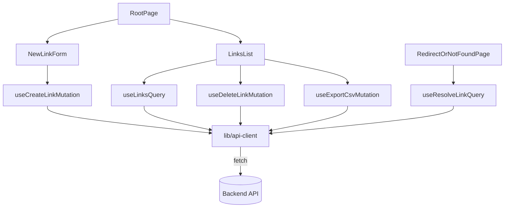

# Frontend Web (Brev.ly) Design

**Spec**: `.specs/features/frontend-web/spec.md`
**Status**: Draft

---

## Architecture Overview

**Abordagens consideradas:**

| Abordagem | Descrição | Trade-off |
| --- | --- | --- |
| A — `useState`/`useEffect` manual pra tudo | Sem lib de data-fetching, cada componente gerencia loading/erro na mão | Zero dependência nova, mas reimplementa cache/retry/invalidação que React Query já resolve — mais código, mais chance de bug de estado |
| **B — React Query + React Hook Form + Zod (recomendada)** | Camada de API isolada (`lib/api-client`) → hooks React Query (`hooks/`) → páginas finas que só compõem componentes de UI | Uma dependência a mais (React Query), mas elimina a maior parte do código de loading/erro/cache manual — exatamente o que o enunciado recomenda pra DX |
| C — Redux/Zustand + camada própria de cache | Estado global genérico | Over-engineering pra uma SPA de 2 páginas com só 5 chamadas de API — não há estado compartilhado complexo o suficiente pra justificar |

**Recomendação**: **B**, mesma lógica do backend: nível certo de estrutura pro tamanho do projeto, sem inventar camada que o enunciado nem pede.



---

## Code Reuse Analysis

Projeto greenfield (pasta `web/` ainda não existe). Reaproveita apenas o contrato já fechado do backend (`.specs/STATE.md` AD-001 a AD-008) — não há código frontend prévio.

### Integration Points

| System | Integration Method |
| --- | --- |
| Backend API (`server/`) | `fetch` via `lib/api-client.ts`, base URL de `import.meta.env.VITE_BACKEND_URL`; contrato exato = AD-008 |
| Clipboard | `navigator.clipboard.writeText` (contexto seguro, escopo aceito — sem fallback pra HTTP puro) |

---

## Components

### `env`
- **Purpose**: Validar `import.meta.env` uma vez (Zod), falhar cedo se `VITE_BACKEND_URL` faltar.
- **Location**: `web/src/env.ts`
- **Interfaces**: `env: { VITE_BACKEND_URL: string; VITE_FRONTEND_URL: string }`
- **Dependencies**: `zod`
- **Reuses**: n/a

### `lib/api-client`
- **Purpose**: Único lugar que sabe fazer `fetch` pro backend — monta URL, serializa body, trata erro `{message}` (AD-007) como `ApiError`.
- **Location**: `web/src/lib/api-client.ts`
- **Interfaces**:
  - `createLink(input: {originalUrl: string; shortUrl: string}): Promise<Link>`
  - `listLinks(page: number, limit: number): Promise<PaginatedLinks>`
  - `deleteLink(id: string): Promise<void>`
  - `resolveLink(shortUrl: string): Promise<{originalUrl: string}>`
  - `exportLinks(): Promise<{url: string}>`
  - `class ApiError extends Error { status: number }`
- **Dependencies**: `env`
- **Reuses**: n/a

### `hooks/useLinksApi`
- **Purpose**: Encapsular as 5 chamadas de `api-client` em hooks do React Query (cache, loading, erro, invalidação).
- **Location**: `web/src/hooks/useLinksApi.ts`
- **Interfaces**:
  - `useLinksQuery(page: number, limit: number)` — `useQuery`
  - `useCreateLinkMutation()` — `useMutation`, invalida a query de listagem em `onSuccess`
  - `useDeleteLinkMutation()` — `useMutation`, remove otimisticamente o item do cache da listagem (rollback se falhar)
  - `useResolveLinkQuery(shortUrl: string)` — `useQuery`, `retry: false` (não faz sentido retentar um 404)
  - `useExportCsvMutation()` — `useMutation`
- **Dependencies**: `lib/api-client`, `@tanstack/react-query`
- **Reuses**: `lib/api-client`

### `components/ui` (Button, Input, Spinner, Logo, IconButton)
- **Purpose**: Componentes de UI genéricos que implementam os estados do Style Guide (primary/secondary, default/hover/disabled, input default/active/error).
- **Location**: `web/src/components/ui/`
- **Interfaces**: `Button({variant, disabled, ...})`, `Input({label, error, ...})`, `Spinner()`, `Logo()`, `IconButton({icon, ...})`
- **Dependencies**: Tailwind (tokens do tema)
- **Reuses**: n/a

### `components/Toast`
- **Purpose**: Notificação simples de sucesso/erro (ex. "Link copiado!", erro ao deletar/exportar) — sem lib nova, sem cor de sucesso dedicada (usa a paleta existente).
- **Location**: `web/src/components/Toast/`
- **Interfaces**: `ToastProvider`, `useToast(): { show(message: string, kind: 'info' | 'error'): void }`
- **Dependencies**: nenhuma (Context + portal)
- **Reuses**: n/a

### `pages/RootPage`
- **Purpose**: Página raiz — compõe o form de criação e a listagem.
- **Location**: `web/src/pages/RootPage/RootPage.tsx`
- **Interfaces**: componente de rota, sem props
- **Dependencies**: `NewLinkForm`, `LinksList`
- **Reuses**: `components/ui`

### `pages/RootPage/NewLinkForm`
- **Purpose**: Form de criação — React Hook Form + Zod, normaliza URL sem protocolo antes de validar (ver Assumption do spec), mostra prefixo fixo `brev.ly/` no campo de slug.
- **Location**: `web/src/pages/RootPage/NewLinkForm.tsx`
- **Interfaces**: componente, sem props (usa `useCreateLinkMutation` internamente)
- **Dependencies**: `react-hook-form`, `zod`, `hooks/useLinksApi`, `components/ui`, `components/Toast`
- **Reuses**: `components/ui/Input`, `components/ui/Button`

### `pages/RootPage/LinksList` + `LinkListItem`
- **Purpose**: Lista paginada — estados de loading/vazio/erro, item com copiar (clique no texto azul) e deletar (ícone lixeira).
- **Location**: `web/src/pages/RootPage/LinksList.tsx`, `LinkListItem.tsx`
- **Interfaces**: `LinksList()`, `LinkListItem({link: Link})`
- **Dependencies**: `hooks/useLinksApi`, `lib/clipboard`, `components/Toast`, `components/ui`
- **Reuses**: `components/ui/Spinner`, `components/ui/IconButton`

### `pages/RootPage/ExportCsvButton`
- **Purpose**: Botão de exportar CSV, desabilitado quando a lista está vazia; ao clicar, busca a URL e navega pra ela (`window.location.href = url`) — evita bloqueio de pop-up (não usa `window.open`).
- **Location**: `web/src/pages/RootPage/ExportCsvButton.tsx`
- **Interfaces**: `ExportCsvButton({disabled: boolean})`
- **Dependencies**: `hooks/useLinksApi`, `components/Toast`
- **Reuses**: `components/ui/Button`

### `pages/RedirectOrNotFoundPage`
- **Purpose**: Rota catch-all (`*`) — extrai o primeiro segmento do path como slug candidato, chama `useResolveLinkQuery`; sucesso → card "Redirecionando..." + `window.location.replace` após delay; falha (404) → conteúdo de "Not Found".
- **Location**: `web/src/pages/RedirectOrNotFoundPage/RedirectOrNotFoundPage.tsx`
- **Interfaces**: componente de rota
- **Dependencies**: `hooks/useLinksApi`, `react-router-dom` (`useParams`/`useLocation`)
- **Reuses**: `components/ui/Logo`

### `router` + `main`
- **Purpose**: Wiring — `createBrowserRouter` com 2 rotas (`/`, `*`), providers (`QueryClientProvider`, `ToastProvider`).
- **Location**: `web/src/router.tsx`, `web/src/main.tsx`
- **Dependencies**: `react-router-dom`, `@tanstack/react-query`
- **Reuses**: `pages/RootPage`, `pages/RedirectOrNotFoundPage`

---

## Data Models

```typescript
interface Link {
  id: string
  originalUrl: string
  shortUrl: string
  accessCount: number
  createdAt: string
}

interface PaginatedLinks {
  items: Link[]
  page: number
  limit: number
  total: number
}
```

Espelha exatamente o contrato AD-008 do backend — sem campo extra, sem transformação de nome.

---

## Error Handling Strategy

| Error Scenario | Handling | User Impact |
| --- | --- | --- |
| `POST /links` → 400 (slug ou URL mal formatada) | Validação client-side já pega a maioria antes de chamar a API; se a API ainda assim rejeitar, `ApiError.message` vira o texto de erro do campo | Erro inline no campo correspondente, form não limpa |
| `POST /links` → 409 (slug duplicado) | `ApiError.message` vira erro inline no campo "Link encurtado" | Usuário troca o slug e tenta de novo |
| `DELETE /links/:id` falha | Remoção otimista do React Query é revertida (`onError` do `useMutation`) | Item volta a aparecer na lista + toast de erro |
| `GET /links` falha | `useLinksQuery` fica em estado de erro | Card de erro com botão "Tentar novamente" no lugar da lista |
| `GET /links/export` falha | `ApiError` capturado no `onError` da mutation | Toast de erro, botão volta ao normal (não fica travado em loading) |
| `GET /links/:shortUrl` → 404 | `useResolveLinkQuery` em estado de erro (sem retry) | Renderiza o conteúdo de "Not Found" |
| Erro de rede genérico (backend fora do ar) | `ApiError` sem `status` específico, mensagem genérica | Toast/estado de erro genérico, nunca uma tela em branco |

---

## Risks & Concerns

| Concern | Location | Impact | Mitigation |
| --- | --- | --- | --- |
| 3 decisões de UX inferidas sem confirmação visual (copiar ao clicar, posição do botão CSV, normalização de URL) — ver spec.md ⭐ | `NewLinkForm.tsx`, `LinkListItem.tsx`, `ExportCsvButton.tsx` | Pode divergir do Figma real se o usuário abrir o arquivo original e a posição/comportamento for diferente | Documentado explicitamente no spec.md; ajuste é localizado (poucos componentes) se precisar corrigir depois |
| Clipboard API exige contexto seguro (HTTPS) | `lib/clipboard.ts` | Copiar não funciona em `http://` puro | Aceito — deploy real de SPA moderna é HTTPS; dev local (`localhost`) é tratado como seguro pelos browsers |
| `window.location.replace` no redirect impede o usuário de "voltar" pra tela de redirecionamento (intencional) | `RedirectOrNotFoundPage.tsx` | Nenhum — é o comportamento correto pra um redirect | N/A |
| Rota catch-all única mistura "slug inexistente" e "rota inválida" no mesmo componente | `router.tsx` | Nenhum — decisão deliberada (ver Assumption do spec), simplifica em vez de complicar | N/A |

> Nenhum outro risco relevante — projeto greenfield.

---

## Tech Decisions (feature-local)

| Decision | Choice | Rationale |
| --- | --- | --- |
| Cliente HTTP | `fetch` nativo, sem axios | Só 5 chamadas, `fetch` já cobre; menos dependência |
| Validação de resposta da API | Nenhuma validação Zod em runtime na resposta (só nos forms) | Backend e frontend estão no mesmo repo/contrato (AD-008); overhead de validar toda resposta não se paga pro tamanho do projeto |
| Download do CSV | `window.location.href = url` (não `window.open`) | Evita bloqueio de pop-up por não ser uma chamada síncrona de `window.open`; navegação de download não perde a página pro usuário |
| Estilização | Tailwind, tokens do tema mapeando 1:1 as cores/tamanhos extraídos do Style Guide | Recomendado pelo enunciado; mobile-first nativo no Tailwind |
| Fonte | Open Sans via `@fontsource/open-sans` (self-hosted) em vez de link pro Google Fonts CDN | Evita dependência de rede externa em runtime, self-hosted é mais previsível pra build de produção |
| Estratégia de teste | Vitest + React Testing Library, API mockada (sem backend real rodando) — mesmo padrão do backend (unit-only, sem dependência externa real em teste) | Consistência com a decisão já tomada no backend; mantém os testes rápidos e determinísticos |

> Nenhuma decisão aqui é project-level nova além do que já está em `STATE.md` (AD-001 a AD-008 já cobrem o contrato compartilhado).

---

## Tips followed
- Interfaces definidas antes da implementação (seção Components)
- Reuso: n/a (greenfield), documentado explicitamente
- Diagrama mermaid cobre o fluxo ponta a ponta das duas páginas
