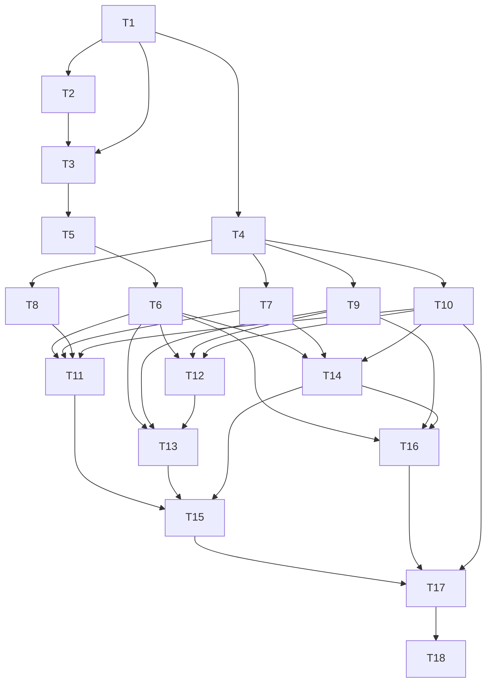

# Frontend Web (Brev.ly) Tasks

## Execution Protocol (MANDATORY -- do not skip)

Implement these tasks with the `tlc-spec-driven` skill: **activate it by name and follow its Execute flow and Critical Rules.** Do not search for skill files by filesystem path. The skill is the source of truth for the full flow (per-task cycle, sub-agent delegation, adequacy review, Verifier, discrimination sensor).

**If the skill cannot be activated, STOP and tell the user — do not proceed without it.**

**Sem commit por task** — implementar + rodar gates, deixar como diff no working tree; só commitar quando o usuário pedir explicitamente (preferência permanente do usuário, ver `.specs/STATE.md`).

---

**Design**: `.specs/features/frontend-web/design.md`
**Status**: Draft

---

## Task Status

> Atualizado pelo orquestrador após cada batch. Nenhuma task é commitada automaticamente.

| Task | Status | Notas |
| --- | --- | --- |
| T1 | ✅ Implementada (não commitada) | Vite+React+TS scaffold real (React 19.2, Vite 8.2) |
| T2 | ✅ Implementada (não commitada) | `.env.example` |
| T3 | ✅ Implementada (não commitada) | `env.ts` Zod |
| T4 | ✅ Implementada (não commitada) | Tailwind 4.3 CSS-first `@theme` com tokens do Style Guide |
| T5 | ✅ Implementada (não commitada) | `api-client.ts`, 6 testes |
| T6 | ✅ Implementada (não commitada) | 5 hooks React Query. **Fix pós-Verifier**: adicionados 7 testes reais (`renderHook`+`QueryClientProvider`, só `api-client` mockado) — a decisão original de "sem teste, coberto indiretamente" era falsa (componentes mockam o hook inteiro). Mutação de rollback confirmada morta pelo teste novo. |
| T7 | ✅ Implementada (não commitada) | Button, 2 testes |
| T8 | ✅ Implementada (não commitada) | Input, 2 testes |
| T9 | ✅ Implementada (não commitada) | Spinner/Logo/IconButton, sem teste (apresentacional) |
| T10 | ✅ Implementada (não commitada) | Toast, 2 testes |
| T11 | ✅ Implementada (não commitada) | NewLinkForm, 9 testes |
| T12 | ✅ Implementada (não commitada) | LinkListItem, 3 testes |
| T13 | ✅ Implementada (não commitada) | LinksList, 5 testes |
| T14 | ✅ Implementada (não commitada) | ExportCsvButton + lib/navigate.ts, 3 testes |
| T15 | ✅ Implementada (não commitada) | RootPage (composição), sem teste dedicado |
| T16 | ✅ Implementada (não commitada) | RedirectOrNotFoundPage, 4 testes |
| T17 | ✅ Implementada (não commitada) | router.tsx + main.tsx, demo do Vite removido, build gate passou |
| T18 | ✅ Verificado (parcial — ver nota) | Fluxo completo verificado via curl direto contra o backend real (CORS preflight, create, list, resolve+increment x2 confirmado accessCount=2, delete, 404 pós-delete, 404 de slug inexistente) — todos corretos. Dev server do front confirmado servindo o shell + `main.tsx` (200). **Não foi possível fazer a checagem visual/responsiva num browser real** — nenhuma ferramenta de automação de browser (chrome-devtools MCP, Playwright) estava conectada nesta sessão; a skill chrome-devtools carregou mas sem servidor MCP por trás. Título da aba corrigido de "web" pra "brev.ly" (index.html). Infra de teste (docker Postgres, dev servers) toda encerrada/limpa ao final. |
| Nota geral | — | Cleanup de teste centralizado em `src/test/setup.ts` (orquestrador, após Batch 2) — 36/36 testes passando, build/typecheck limpos |

## Test Coverage Matrix

> Gerado a partir do design.md + mesma decisão de estratégia de teste já usada no backend (Vitest, dependências externas mockadas — aqui, a API é mockada em vez do Postgres). Sem Playwright/e2e contra backend real, por consistência com essa decisão e com a preferência do usuário de não rodar e2e sem pedido explícito.

| Code Layer | Required Test Type | Coverage Expectation | Location Pattern | Run Command |
| --- | --- | --- | --- | --- |
| `lib/api-client.ts` | unit | Cada método (createLink/listLinks/deleteLink/resolveLink/exportLinks): URL/método/body corretos (fetch mockado) + mapeamento de resposta não-2xx pra `ApiError` | `web/src/lib/__tests__/api-client.test.ts` | `npm test` |
| `hooks/useLinksApi.ts` | unit (`renderHook` + `QueryClientProvider` real, só `lib/api-client` mockado) | Invalidação de cache no create, remoção otimista + rollback no delete, `retry:false` no resolve — **correção pós-Verifier**: a decisão original ("exercitado indiretamente") estava errada — todo teste de componente mocka o módulo `hooks/useLinksApi` inteiro, então a lógica real do hook nunca rodava. Confirmado por mutation testing (ver validation.md) | `web/src/hooks/__tests__/useLinksApi.test.tsx` | `npm test` |
| `components/ui/Button.tsx`, `Input.tsx` | unit (component) | Estado disabled bloqueia `onClick`/submit; `Input` mostra label e mensagem de erro quando `error` é passado | `web/src/components/ui/__tests__/*.test.tsx` | `npm test` |
| `components/ui/Spinner.tsx`, `Logo.tsx`, `IconButton.tsx` | none | Puramente apresentacional | — | `npm run typecheck` |
| `components/Toast` | unit (component) | `show()` renderiza a mensagem; `kind: 'error'` aplica estilo de erro | `web/src/components/Toast/__tests__/*.test.tsx` | `npm test` |
| `pages/RootPage/NewLinkForm.tsx` | unit (component, RTL) | Happy path (FORM-01) + slug inválido (FORM-02) + URL inválida mesmo após normalizar (FORM-03) + 409 do backend (FORM-04) + botão disabled com form vazio/inválido/pending (FORM-05) | `web/src/pages/RootPage/__tests__/NewLinkForm.test.tsx` | `npm test` |
| `pages/RootPage/LinksList.tsx` + `LinkListItem.tsx` | unit (component, RTL) | Loading (LIST-01) + vazio (LIST-02) + erro com retry (LIST-03) + copiar (LIST-04) + paginação (LIST-05) + deletar sucesso/erro (DEL-01/02) | `web/src/pages/RootPage/__tests__/LinksList.test.tsx` | `npm test` |
| `pages/RootPage/ExportCsvButton.tsx` | unit (component, RTL) | Habilitado com lista não-vazia / desabilitado vazia (CSV-01/02) + erro na exportação (CSV-03) | `web/src/pages/RootPage/__tests__/ExportCsvButton.test.tsx` | `npm test` |
| `pages/RedirectOrNotFoundPage.tsx` | unit (component, RTL) | Resolve com sucesso → redireciona + link manual ativo (REDIR-01/02) + resolve 404 → conteúdo not found (REDIR-03) + rota desconhecida → not found (NF-01) | `web/src/pages/RedirectOrNotFoundPage/__tests__/*.test.tsx` | `npm test` |
| `env.ts`, `router.tsx`, `main.tsx`, configs (vite/tailwind/tsconfig) | none | Build/typecheck gate only + smoke test manual (T18) | — | `npm run typecheck`, `npm run build` |

## Gate Check Commands

| Gate Level | When to Use | Command |
| --- | --- | --- |
| Quick | Depois de qualquer task com teste unitário/componente | `npm run typecheck && npm test` |
| Full | Não se aplica neste projeto — sem camada e2e (mesma decisão do backend) | mesmo que Quick |
| Build | Fim de fase, ou tasks só de config (T1, T2, T4, T17) | `npm run build && npm run typecheck && npm test` |

---

## Execution Plan

### Phase 1: Foundation (scaffold, env, API client, hooks)

```
T1 → T2 → T3 → T4 → T5 → T6
```

### Phase 2: UI kit (componentes genéricos + toast)

```
T7 → T8 → T9 → T10
```

### Phase 3: Página raiz (form + listagem + export)

```
T11 → T12 → T13 → T14 → T15
```

### Phase 4: Redirect/Not Found + wiring final

```
T16 → T17 → T18
```

---

## Task Breakdown

### T1: Scaffold do projeto Vite + React + TS (`web/`)

**What**: Criar `web/package.json` (scripts: `dev`, `build`, `preview`, `test`, `typecheck`), `web/vite.config.ts`, `web/tsconfig.json`, `web/index.html`. Dependências: react, react-dom, react-router-dom, @tanstack/react-query, react-hook-form, zod, @hookform/resolvers, tailwindcss (+ plugin Vite), @fontsource/open-sans. Dev: typescript, vite, @vitejs/plugin-react, vitest, @testing-library/react, @testing-library/jest-dom, @testing-library/user-event, jsdom, @types/react, @types/react-dom.
**Where**: `web/package.json`, `web/vite.config.ts`, `web/tsconfig.json`, `web/index.html`
**Depends on**: None
**Reuses**: n/a
**Requirement**: base de todas

**Tools**: MCP: NONE · Skill: NONE

**Done when**:
- [ ] `npm install` roda sem erro dentro de `web/`
- [ ] `npm run typecheck` e `npm test` existem e rodam (mesmo sem código-fonte ainda)
- [ ] Vitest configurado com `environment: 'jsdom'`

**Tests**: none
**Gate**: build
**Commit**: `feat(web): scaffold projeto Vite + React + TypeScript`

---

### T2: `.env.example`

**What**: Criar `web/.env.example` com `VITE_FRONTEND_URL` e `VITE_BACKEND_URL`.
**Where**: `web/.env.example`
**Depends on**: T1
**Requirement**: base de env

**Tools**: MCP: NONE · Skill: NONE

**Done when**:
- [ ] Contém exatamente as 2 chaves exigidas pelo enunciado

**Tests**: none
**Gate**: build
**Commit**: `feat(web): adicionar .env.example`

---

### T3: `env.ts`

**What**: Validar `import.meta.env` (Zod) — `VITE_BACKEND_URL` obrigatório, `VITE_FRONTEND_URL` obrigatório.
**Where**: `web/src/env.ts`
**Depends on**: T1, T2
**Requirement**: base de env

**Tools**: MCP: NONE · Skill: NONE

**Done when**:
- [ ] `env` exporta as 2 chaves tipadas
- [ ] `npm run typecheck` passa

**Tests**: none
**Gate**: quick
**Commit**: `feat(web): validar variáveis de ambiente com zod`

---

### T4: Tailwind + tema (cores/tipografia do Style Guide) + fonte

**What**: Configurar Tailwind (plugin Vite), tema com as cores extraídas (`blue-base #2C46B1`, `blue-dark #2C4091`, `gray-100..600`, `danger #B12C4D`) e escala tipográfica (`text-xl/lg/md/sm/xs` conforme tabela do design.md), importar Open Sans via `@fontsource/open-sans` no CSS global.
**Where**: `web/tailwind.config.ts` (ou config equivalente da versão instalada), `web/src/index.css`
**Depends on**: T1
**Requirement**: base visual de todas as páginas

**Tools**: MCP: NONE · Skill: NONE

**Done when**:
- [ ] Tokens de cor e tamanho de texto do Style Guide disponíveis como classes Tailwind
- [ ] Open Sans carregada e aplicada como fonte padrão
- [ ] `npm run build` gera CSS sem erro

**Tests**: none
**Gate**: build
**Commit**: `feat(web): configurar Tailwind com tema do Style Guide`

---

### T5: `lib/api-client.ts` + tipos

**What**: Implementar `createLink`, `listLinks`, `deleteLink`, `resolveLink`, `exportLinks` (fetch nativo, base `env.VITE_BACKEND_URL`), `class ApiError extends Error { status: number }` mapeando respostas não-2xx (`{message}}`), tipos `Link`/`PaginatedLinks`.
**Where**: `web/src/lib/api-client.ts`, `web/src/types.ts` (ou tipos no mesmo arquivo)
**Depends on**: T3
**Reuses**: `env` (T3)
**Requirement**: base de FORM/LIST/DEL/CSV/REDIR

**Tools**: MCP: NONE · Skill: NONE

**Done when**:
- [ ] Testes cobrem os 5 métodos com `fetch` mockado: URL/método/headers/body corretos em cada um; resposta não-2xx vira `ApiError` com `status` e `message` do corpo
- [ ] Gate quick passa
- [ ] Contagem de testes: ≥6 (1 por método + 1 de mapeamento de erro)

**Tests**: unit
**Gate**: quick
**Commit**: `feat(web): client HTTP pra API do backend`

---

### T6: `hooks/useLinksApi.ts`

**What**: `useLinksQuery(page, limit)`, `useCreateLinkMutation()` (invalida listagem em sucesso), `useDeleteLinkMutation()` (remoção otimista + rollback em erro), `useResolveLinkQuery(shortUrl)` (`retry: false`), `useExportCsvMutation()`.
**Where**: `web/src/hooks/useLinksApi.ts`
**Depends on**: T5
**Reuses**: `lib/api-client` (T5)
**Requirement**: base de FORM/LIST/DEL/CSV/REDIR

**Tools**: MCP: NONE · Skill: NONE

**Done when**:
- [ ] Os 5 hooks existem com as assinaturas do design.md
- [ ] `npm run typecheck` passa
- [ ] Sem teste dedicado (decisão da matriz — coberto pelos testes de componente que os usam nas próximas fases)

**Tests**: none
**Gate**: quick
**Commit**: `feat(web): hooks React Query pra API de links`

---

### T7: `components/ui/Button.tsx`

**What**: Botão com variantes `primary`/`secondary`, estado `disabled` (visual + bloqueia `onClick`), conforme Style Guide.
**Where**: `web/src/components/ui/Button.tsx`
**Depends on**: T4
**Requirement**: base visual

**Tools**: MCP: NONE · Skill: NONE

**Done when**:
- [ ] Teste cobre: `disabled` não dispara `onClick` ao clicar; variantes renderizam classes/estilo esperado
- [ ] Gate quick passa
- [ ] Contagem de testes: 2

**Tests**: unit (component)
**Gate**: quick
**Commit**: `feat(web): componente Button`

---

### T8: `components/ui/Input.tsx`

**What**: Input com label (uppercase, Text Xs), estado de erro (borda + mensagem + ícone de alerta), conforme Style Guide.
**Where**: `web/src/components/ui/Input.tsx`
**Depends on**: T4
**Requirement**: base visual

**Tools**: MCP: NONE · Skill: NONE

**Done when**:
- [ ] Teste cobre: renderiza label; com `error` mostra a mensagem de erro; sem `error` não mostra
- [ ] Gate quick passa
- [ ] Contagem de testes: 2

**Tests**: unit (component)
**Gate**: quick
**Commit**: `feat(web): componente Input`

---

### T9: `components/ui/Spinner.tsx`, `Logo.tsx`, `IconButton.tsx`

**What**: 3 componentes apresentacionais simples — spinner de carregamento, logo (ícone + wordmark "brev.ly"), botão só-ícone (usado pelo delete).
**Where**: `web/src/components/ui/Spinner.tsx`, `Logo.tsx`, `IconButton.tsx`
**Depends on**: T4
**Requirement**: base visual

**Tools**: MCP: NONE · Skill: NONE

**Done when**:
- [ ] Os 3 componentes renderizam sem erro (verificado via `npm run build`/`typecheck`, sem teste dedicado — puramente apresentacional)

**Tests**: none
**Gate**: quick
**Commit**: `feat(web): componentes Spinner, Logo e IconButton`

---

### T10: `components/Toast`

**What**: `ToastProvider` + `useToast(): {show(message, kind)}` — Context + portal, sem lib nova, sem cor de sucesso dedicada (usa paleta existente).
**Where**: `web/src/components/Toast/ToastProvider.tsx`, `useToast.ts`
**Depends on**: T4
**Requirement**: base de feedback (LIST-04, DEL-02, CSV-03)

**Tools**: MCP: NONE · Skill: NONE

**Done when**:
- [ ] Teste cobre: `show('msg', 'info')` renderiza a mensagem na tela; `show('msg', 'error')` aplica estilo de erro
- [ ] Gate quick passa
- [ ] Contagem de testes: 2

**Tests**: unit (component)
**Gate**: quick
**Commit**: `feat(web): sistema de toast`

---

### T11: `pages/RootPage/NewLinkForm.tsx`

**What**: Form com React Hook Form + Zod — campo "Link original" (normaliza pra `https://` quando falta protocolo antes de validar), campo "Link encurtado" (prefixo fixo `brev.ly/`, valida `^[a-zA-Z0-9-_]{1,60}$`), botão "Salvar link" desabilitado quando form vazio/inválido/pending, chama `useCreateLinkMutation`, limpa o form em sucesso, mapeia erro 409 pro campo de slug.
**Where**: `web/src/pages/RootPage/NewLinkForm.tsx`
**Depends on**: T6, T7, T8, T10
**Reuses**: `hooks/useLinksApi` (T6), `components/ui/Button` (T7), `components/ui/Input` (T8), `components/Toast` (T10)
**Requirement**: FORM-01, FORM-02, FORM-03, FORM-04, FORM-05

**Tools**: MCP: NONE · Skill: NONE

**Done when**:
- [ ] Testes cobrem (mutation mockada via `hooks/useLinksApi`): submit válido → chama `createLink` e limpa o form (FORM-01); slug inválido → erro inline, não chama a API (FORM-02); URL sem protocolo é normalizada antes de validar, URL realmente inválida mostra erro (FORM-03); erro 409 da mutation → aparece no campo de slug, form não limpa (FORM-04); botão disabled com campos vazios e durante submissão (FORM-05)
- [ ] Gate quick passa
- [ ] Contagem de testes: ≥6

**Tests**: unit (component)
**Gate**: quick
**Commit**: `feat(web): formulário de criação de link`

---

### T12: `pages/RootPage/LinkListItem.tsx`

**What**: Item da lista — link encurtado em azul (clique copia `https://brev.ly/slug` + feedback via `useToast`), URL original abaixo, ícone de lixeira (chama `useDeleteLinkMutation`, sem modal de confirmação).
**Where**: `web/src/pages/RootPage/LinkListItem.tsx`
**Depends on**: T6, T9, T10
**Reuses**: `hooks/useLinksApi` (T6), `components/ui/IconButton` (T9), `components/Toast` (T10)
**Requirement**: LIST-04, DEL-01, DEL-02

**Tools**: MCP: NONE · Skill: NONE

**Done when**:
- [ ] Testes cobrem: clicar no texto do link chama `navigator.clipboard.writeText` com a URL completa e mostra toast (LIST-04, clipboard mockado); clicar no ícone de deletar chama a mutation de delete (DEL-01); erro na mutation mostra toast de erro e o item não some do estado local antes da confirmação (DEL-02)
- [ ] Gate quick passa
- [ ] Contagem de testes: 3

**Tests**: unit (component)
**Gate**: quick
**Commit**: `feat(web): item da lista de links`

---

### T13: `pages/RootPage/LinksList.tsx`

**What**: Lista paginada — usa `useLinksQuery`, estados de loading (spinner), vazio (ícone + "Ainda não existem links cadastrados"), erro (mensagem + botão "Tentar novamente"), controles de paginação Anterior/Próxima (ocultos/desabilitados quando só há 1 página), renderiza `LinkListItem` por item.
**Where**: `web/src/pages/RootPage/LinksList.tsx`
**Depends on**: T6, T9, T12
**Reuses**: `hooks/useLinksApi` (T6), `components/ui/Spinner` (T9), `LinkListItem` (T12)
**Requirement**: LIST-01, LIST-02, LIST-03, LIST-05

**Tools**: MCP: NONE · Skill: NONE

**Done when**:
- [ ] Testes cobrem: estado de loading mostra spinner (LIST-01); lista vazia mostra empty state (LIST-02); erro na query mostra mensagem + retry, clicar em retry rechama a query (LIST-03); com `total > limit` mostra controles de paginação funcionais, com `total <= limit` não mostra (LIST-05)
- [ ] Gate quick passa
- [ ] Contagem de testes: 5

**Tests**: unit (component)
**Gate**: quick
**Commit**: `feat(web): listagem de links com paginação`

---

### T14: `pages/RootPage/ExportCsvButton.tsx`

**What**: Botão "Baixar CSV" — desabilitado quando `linksCount === 0`, ao clicar chama `useExportCsvMutation`, em sucesso navega pra URL retornada via um helper `navigateTo(url)` extraído (testável — não `window.location.href` inline), em erro mostra toast.
**Where**: `web/src/pages/RootPage/ExportCsvButton.tsx`, `web/src/lib/navigate.ts` (helper extraído)
**Depends on**: T6, T7, T10
**Reuses**: `hooks/useLinksApi` (T6), `components/ui/Button` (T7), `components/Toast` (T10)
**Requirement**: CSV-01, CSV-02, CSV-03

**Tools**: MCP: NONE · Skill: NONE

**Done when**:
- [ ] Testes cobrem (mutation e `navigateTo` mockados): `linksCount > 0` habilita o botão, sucesso chama `navigateTo(url)` com a URL retornada (CSV-01); `linksCount === 0` desabilita e não chama a mutation ao clicar (CSV-02); erro na mutation mostra toast, `navigateTo` não é chamado (CSV-03)
- [ ] Gate quick passa
- [ ] Contagem de testes: 3

**Tests**: unit (component)
**Gate**: quick
**Commit**: `feat(web): botão de exportar CSV`

---

### T15: `pages/RootPage/RootPage.tsx`

**What**: Compõe o header (Logo), `NewLinkForm`, `LinksList` e `ExportCsvButton` no layout de 2 cards (lado a lado no desktop, empilhado no mobile via Tailwind responsive classes).
**Where**: `web/src/pages/RootPage/RootPage.tsx`
**Depends on**: T11, T13, T14
**Reuses**: `NewLinkForm` (T11), `LinksList` (T13), `ExportCsvButton` (T14), `components/ui/Logo` (T9)
**Requirement**: layout de todas as ACs de P1/P2

**Tools**: MCP: NONE · Skill: NONE

**Done when**:
- [ ] `npm run typecheck` passa
- [ ] Composição renderiza sem erro (verificação via build; comportamento de cada peça já testado nas tasks anteriores — evita duplicar teste)

**Tests**: none
**Gate**: quick
**Commit**: `feat(web): página raiz`

---

### T16: `pages/RedirectOrNotFoundPage.tsx`

**What**: Extrai o slug do path (`useParams`/`useLocation`), chama `useResolveLinkQuery`; enquanto carrega mostra card "Redirecionando..." (logo, texto, link "Acesse aqui" com `href` da URL resolvida assim que disponível); em sucesso, agenda `navigateTo` (mesmo helper de T14, via `window.location.replace`) após ~1.5s; em erro (404) renderiza o conteúdo de "Link não encontrado" (ilustração 404, texto).
**Where**: `web/src/pages/RedirectOrNotFoundPage/RedirectOrNotFoundPage.tsx`
**Depends on**: T6, T9, T14
**Reuses**: `hooks/useLinksApi` (T6), `components/ui/Logo` (T9), `lib/navigate` (T14)
**Requirement**: REDIR-01, REDIR-02, REDIR-03, NF-01

**Tools**: MCP: NONE · Skill: NONE

**Done when**:
- [ ] Testes cobrem (query mockada, timers falsos pro delay): resolução com sucesso → mostra "Redirecionando...", link "Acesse aqui" com `href` correto imediatamente, `navigateTo` chamado com a URL original após o delay (REDIR-01/02); resolução com 404 → mostra "Link não encontrado" (REDIR-03); path que não corresponde a nenhum slug válido cai no mesmo componente e mesmo resultado de erro (NF-01)
- [ ] Gate quick passa
- [ ] Contagem de testes: 4

**Tests**: unit (component)
**Gate**: quick
**Commit**: `feat(web): página de redirecionamento e não encontrado`

---

### T17: `router.tsx` + `main.tsx`

**What**: `createBrowserRouter` com rotas `/` (`RootPage`) e `*` (`RedirectOrNotFoundPage`); `main.tsx` monta com `QueryClientProvider` + `ToastProvider` + `RouterProvider`.
**Where**: `web/src/router.tsx`, `web/src/main.tsx`
**Depends on**: T15, T16, T10
**Reuses**: `RootPage` (T15), `RedirectOrNotFoundPage` (T16), `ToastProvider` (T10)
**Requirement**: wiring de todas as rotas

**Tools**: MCP: NONE · Skill: NONE

**Done when**:
- [ ] `npm run build && npm run typecheck && npm test` passa
- [ ] `npm run dev` sobe sem erro (verificação manual, junto com T18)

**Tests**: none
**Gate**: build
**Commit**: `feat(web): roteamento e bootstrap da aplicação`

---

### T18: Smoke test manual ponta a ponta + responsividade

**What**: Com o backend (`server/`) rodando localmente contra Postgres real (igual smoke test do backend) e `npm run dev` do `web/` apontando `VITE_BACKEND_URL` pra ele, validar manualmente via browser: criar link → aparece na lista → copiar → deletar → exportar CSV (baixa/abre) → acessar `/:shortUrl` de um link real (redireciona, contador incrementa) → acessar slug inexistente e rota aleatória (mostra not found) → redimensionar a janela entre ~390px e ~1366px (layout se adapta sem quebrar).
**Where**: nenhum arquivo (verificação manual)
**Depends on**: T17
**Requirement**: validação end-to-end de todas as ACs

**Tools**: MCP: NONE · Skill: NONE

**Done when**:
- [ ] Todo o fluxo listado acima funciona contra o backend real
- [ ] Responsividade confirmada visualmente nos dois breakpoints

**Tests**: none (manual, mesma decisão do backend)
**Gate**: build
**Commit**: `chore(web): validação manual ponta a ponta` (ou sem commit, se nada de código mudar nesta task)

---

## Phase Execution Map



**Empacotamento em batches (~7 tasks/worker, fases inteiras):**

| Batch | Fases | Tasks | Total |
| --- | --- | --- | --- |
| 1 | Phase 1 | T1-T6 | 6 |
| 2 | Phase 2 | T7-T10 | 4 |
| 3 | Phase 3 | T11-T15 | 5 |
| 4 | Phase 4 | T16-T18 | 3 |

18 tasks totais → 4 batches. Ultrapassa o limiar de ~8, então a oferta de sub-agents é apresentada antes do Execute (mesmo padrão do backend).

---

## Task Granularity Check

| Task | Scope | Status |
| --- | --- | --- |
| T1 | 1 config (scaffold) | ✅ Granular |
| T2 | 1 arquivo | ✅ Granular |
| T3 | 1 função (env loader) | ✅ Granular |
| T4 | 1 config de tema (cohesivo: cores+tipografia+fonte são a mesma preocupação visual) | ✅ Granular |
| T5 | 5 funções cohesivas (mesmo arquivo, mesmo cliente HTTP) | ✅ Granular |
| T6 | 5 hooks cohesivos (mesmo arquivo, mesma camada de API) | ✅ Granular |
| T7 | 1 componente | ✅ Granular |
| T8 | 1 componente | ✅ Granular |
| T9 | 3 componentes triviais cohesivos (sem lógica, mesma leva de primitivos visuais) | ✅ Granular |
| T10 | 1 componente (provider+hook) | ✅ Granular |
| T11 | 1 componente (form) | ✅ Granular |
| T12 | 1 componente | ✅ Granular |
| T13 | 1 componente | ✅ Granular |
| T14 | 1 componente + 1 helper cohesivo | ✅ Granular |
| T15 | 1 componente (composição) | ✅ Granular |
| T16 | 1 componente | ✅ Granular |
| T17 | 2 arquivos cohesivos (mesma preocupação: bootstrap) | ✅ Granular |
| T18 | 1 verificação manual | ✅ Granular |

Nenhum item ultrapassa "2-3 coisas relacionadas no mesmo arquivo".

---

## Diagram-Definition Cross-Check

| Task | Depends On (corpo da task) | Diagrama mostra | Status |
| --- | --- | --- | --- |
| T1 | None | (raiz) | ✅ Match |
| T2 | T1 | T1→T2 | ✅ Match |
| T3 | T1, T2 | T1→T3, T2→T3 | ✅ Match |
| T4 | T1 | T1→T4 | ✅ Match |
| T5 | T3 | T3→T5 | ✅ Match |
| T6 | T5 | T5→T6 | ✅ Match |
| T7 | T4 | T4→T7 | ✅ Match |
| T8 | T4 | T4→T8 | ✅ Match |
| T9 | T4 | T4→T9 | ✅ Match |
| T10 | T4 | T4→T10 | ✅ Match |
| T11 | T6, T7, T8, T10 | T6→T11, T7→T11, T8→T11, T10→T11 | ✅ Match |
| T12 | T6, T9, T10 | T6→T12, T9→T12, T10→T12 | ✅ Match |
| T13 | T6, T9, T12 | T6→T13, T9→T13, T12→T13 | ✅ Match |
| T14 | T6, T7, T10 | T6→T14, T7→T14, T10→T14 | ✅ Match |
| T15 | T11, T13, T14 | T11→T15, T13→T15, T14→T15 | ✅ Match |
| T16 | T6, T9, T14 | T6→T16, T9→T16, T14→T16 | ✅ Match |
| T17 | T15, T16, T10 | T15→T17, T16→T17, T10→T17 | ✅ Match |
| T18 | T17 | T17→T18 | ✅ Match |

Nenhuma dependência aponta pra uma fase posterior.

---

## Test Co-location Validation

| Task | Code Layer Criado/Modificado | Matrix Exige | Task Diz | Status |
| --- | --- | --- | --- | --- |
| T1 | config/scaffold | none | none | ✅ OK |
| T2 | config | none | none | ✅ OK |
| T3 | env/config | none | none | ✅ OK |
| T4 | tema/config | none | none | ✅ OK |
| T5 | api-client | unit | unit | ✅ OK |
| T6 | hooks (exercitados indiretamente) | none | none | ✅ OK |
| T7 | Button | unit (component) | unit (component) | ✅ OK |
| T8 | Input | unit (component) | unit (component) | ✅ OK |
| T9 | Spinner/Logo/IconButton | none | none | ✅ OK |
| T10 | Toast | unit (component) | unit (component) | ✅ OK |
| T11 | NewLinkForm | unit (component) | unit (component) | ✅ OK |
| T12 | LinkListItem | unit (component) | unit (component) | ✅ OK |
| T13 | LinksList | unit (component) | unit (component) | ✅ OK |
| T14 | ExportCsvButton | unit (component) | unit (component) | ✅ OK |
| T15 | RootPage (composição) | none | none | ✅ OK |
| T16 | RedirectOrNotFoundPage | unit (component) | unit (component) | ✅ OK |
| T17 | router/main (config) | none | none | ✅ OK |
| T18 | manual | none | none | ✅ OK |

Nenhuma violação — nenhuma task adia teste pra depois, nenhuma duplica cobertura (hooks testados só via componente).

---

## MCPs e Skills

Nenhum MCP especializado se aplica (projeto Vite/React/TS padrão). Pergunta formal "quais ferramentas usar por task" fica pra quando o usuário confirmar o início do Execute — ver `.specs/STATE.md` Handoff.
